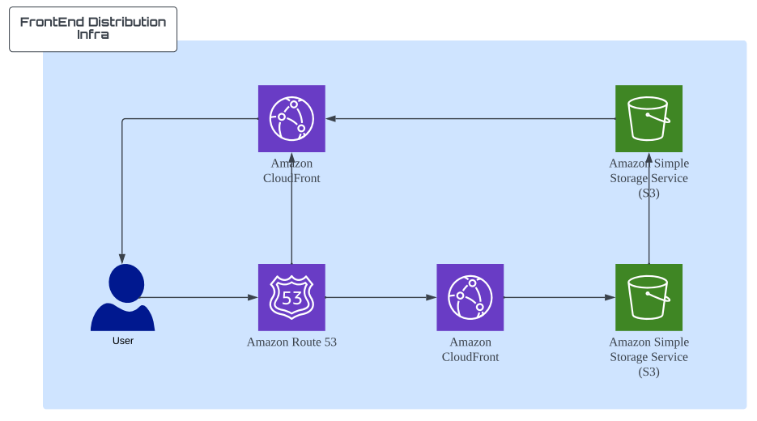
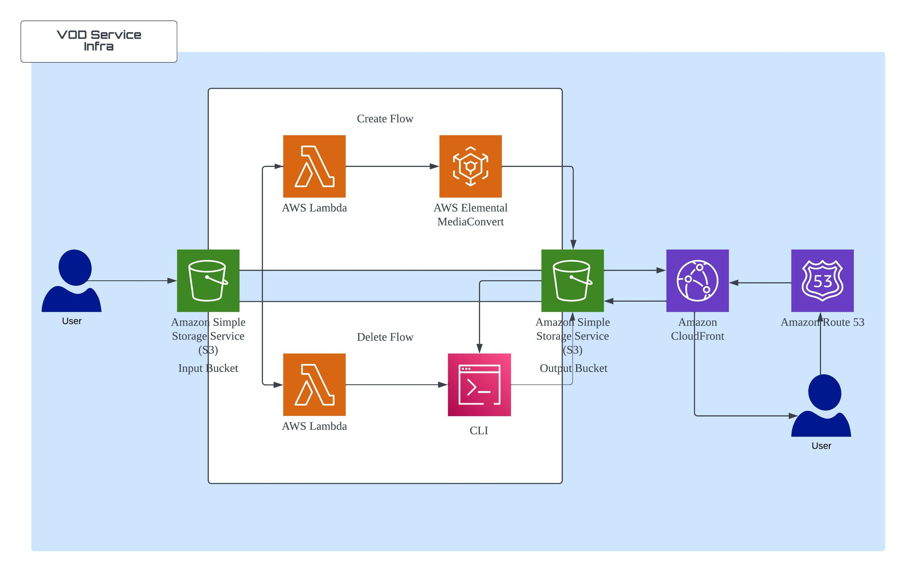
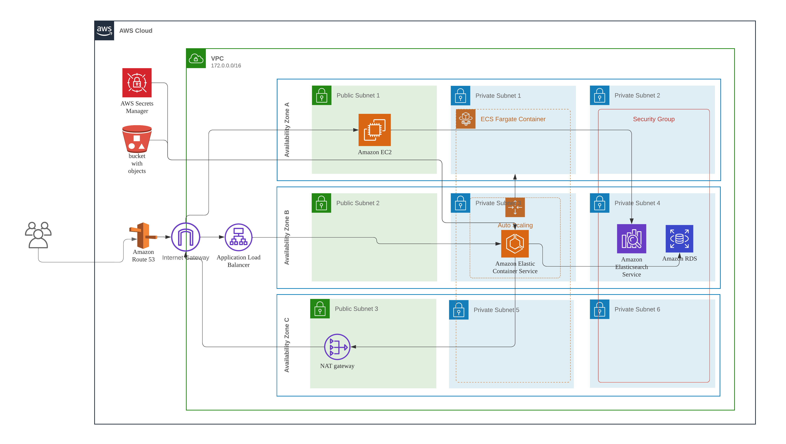

# 프로젝트 결과 보고서

---

## 프로젝트 개요

### 서비스 소개

- 💡 **구름 에듀 클론 코딩 - 강의 영상 제공 웹 서비스**
- 💡 **자신의 강의를 업로드하고 다양한 강의를 수강할 수 있는 서비스**

---

## 팀원 및 역할

### 노지원(팀장)

- FE 페이지 전체 구현
- API 서비스 로직 작성
- 프로젝트 진행관리

### 강상우

- API 서버 인프라 구축 및 IaC(테라폼) 코드 작성
- Opensearch Proxy 서버 구축
- API 서버 CD Pipeline 구축
- API 서버 서비스 로직 작성

### 정인창

- API 서비스 로직 작성

### 주수영

- FE 디자인 가이드 제공
- VOD 및 웹 호스팅 IaC (terraform) 코드 작성
- CI / CD (terraform + github)

### 김현희

- Github Action CI + AWS ECR 연동하여 Image Pipeline 구축
- AWS ECS Fargate 생성 및 로그 수집을 위한 log_router 컨테이너 연동
- 로그 수집을 위한 AWS OpenSearch 환경 구축
- AWS CloudWatch로 트래픽 모니터링 서비스 구축

### 이용우

- VOD 변환 인프라 구축
- 웹 호스팅 인프라 구축
- CI / CD (terraform + github)

---

## 프로젝트 진행 프로세스

### 프로젝트 전체 일정

| 내용                                                            | 날짜                              | 주차  |
| --------------------------------------------------------------- | --------------------------------- | ----- |
| 프로젝트 기획 회의, 방향성 결정, 역할 분담                      | 2022년 3월 24일 → 2022년 3월 25일 | 0주차 |
| 프로젝트 기획, 기술 문서 작성, 파트별 일정 정리, 기초 환경 구성 | 2022년 3월 28일 → 2022년 4월 1일  | 1주차 |
| 파트별 기초 서비스 구현 및 발생한 문제 정리, 해결               | 2022년 4월 4일 → 2022년 4월 8일   | 2주차 |
| 파트별 일부 서비스 구현 및 발생한 문제 정리, 해결               | 2022년 4월 11일 → 2022년 4월 15일 | 3주차 |
| 파트별 세부 서비스 구현 및 발생한 문제 정리, 해결               | 2022년 4월 18일 → 2022년 4월 22일 | 4주차 |
| 버그 수정 및 추가 기능 구현, 테스트                             | 2022년 4월 25일 → 2022년 4월 29일 | 5주차 |

### 프로젝트 관리 방안

- **노션 페이지를 활용하여 전체 자료 공유**
- 매일 6시 파트별 **일일 보고**를 통한 **서로의 진행상황 상세 공유**

---

- **프로젝트 결과물이 도출된 과정을 세부적으로 기록해주세요**
- **활용된 기술(구현 방법), 핵심 기능, 검증 결과 등을 상세히 기재해주세요**

## 프로젝트 결과

---

### 인프라 결과 정리

### **프론트엔트 인프라**

1. Route 53와 S3 를 이용한 정적 웹 호스팅
2. CloudFront와 Certificate Manager 를 이용한 https 프로토콜 지원
3. 추가적인 CloudFront 배포를 이용한 서브 도메인 리다이렉션

### VOD 서비스 인프라

1. S3의 object 이벤트를 수신하여 Lambda 실행
   -> MediaConvert 수행 또는, S3 API 호출 (create, delete)
2. CloudFornt를 통해 MediaConvert 서비스를 통해 생성된 데이터 스트리밍

### 백앤드 결과 정리

### InfraStructure

- **CI/CD**
  Github의 Main Branch에 Merge이벤트가 발생하면 Github Action에 정의된 workflow에 따라서 자동적으로 API 서버의 Node-js Docker 이미지를 생성한 뒤 ECR에 푸시합니다. 그 후 AWS ECR 서비스에 새로 생성된 이미지를 Fargate로 자동으로 배포합니다.
- **OpenSearch(ElasticSearch)**
  ECS 각각의 Fargate에서 발생된 로그를 Firelens로 수집하여 Opensearch의 Dashboard에서 필터링하여 검색 및 조회할 수 있습니다. ECS 각각으로 흩어진 로그를 한 번에 모아준다는 편리성이 있습니다.
- **Secrets Manager**
  Node-js API 서버에서 필요한 민감한 데이터들을 Secrets Manager를 통해서 조회하여 AWS Key, JWT SecretKey, 각종 API Key 들이 노출되지 않도록 보호합니다.
- **Application Load Balancer and Auto Scailing**
  가용성이 높은 인프라를 구축하기 위하여 가용 영역을 3곳으로 지정하고 API 서버 Fargate Auto Scailing을 적용하여 서버의 CPU가 75% 이상 사용되면 최대 4개의 Fargate로 늘어나고 로드밸런싱하여 분산 처리하도록 구축하였습니다. CPU의 사용이 줄어들면 작업도 그에 맞춰 자동으로 줄어듭니다.

### Backend

- **SonarCloud**
  SonarCloud를 연동하여 강력한 정적 코드 분석기를 통해 찾기 어려운 버그와 보안 취약점들을 점검하였습니다.
- **Sentry**
  어플리케이션에서 오류가 발생하면 알려주는 에러 트래킹 서비스를 적용하였습니다.
- **ORM**
  TypeORM을 통하여 객체를 RDBMS 테이블 시스템으로 변형 및 연결을 적용했으며 RDS MySQL을 사용하여 데이터 관리를 수행하였습니다.
- **PM2**
  API 서버가 Node-js로 만들어졌기 때문에 단일 프로세스로서 동작되는데 CPU 개수만큼 워커 프로세스를 생성해서 모든 코어를 사용하게 했으며 메모리 제한선에 도달하거나 예상치 못한 오류로 종료되면 재시작하도록 구현하였습니다.

### 프론트

- [테스트 영상](https://youtube.com/playlist?list=PLA-hRKB6mUnRIYJEBvH5Y2BYY3Uw7RU7E)

## 전체 서비스 자체 평가 및 보완

- 초기에 기획한 의도에 맞는 적절한 웹서비스를 배포하였음
- 서비스 인프라 환경을 목적에 맞게 보안을 고려하여 구축하는 것에 성공하였음
- 강의 내용에서 추가 설명이 짧은 글만 작성 가능하다는 아쉬움이 있음
  ex) 위지윅 에디터등을 추가할 필요가 있음
- 서비스 자체의 보안에 미흡한 부분이 많음
  ex) 스트리밍 파일을 보호하지 않음, jwt토큰을 만료시키지 않음
- 대형 서비스의 규모를 생각하여 EKS로 작성하지 못해 아쉬움
- 서비스가 커질 경우 세분화된 모니터링의 필요성을 느낌
